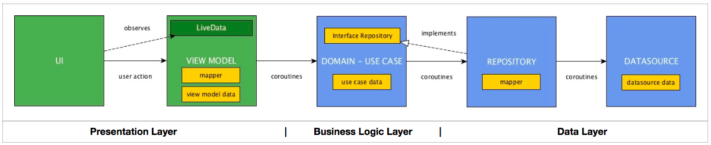

# Mobile Assignment CS
I have built this application in clean architecture and MVVM presentation archticture. It's well tested and documented for all layers data, domain, and presentation.

How to build it on your environment?
--------------
For secutity wise, I have hidden my API key from the project and added it in local.properties<br />
In order to build the project properly in your machince, you have to add your [The Movie DB](https://www.themoviedb.org)'s API key in your `local.properties` file.
```xml
API_KEY="YOUR_API_KEY"
```

## App architecture


## Decisions
- Used TDD approach while implementing the project
- Implemented 2 extra gradle files to organize dependencies versions and groups.
- Implemented Detct tool to make static analysis and generates reports in ```/app/build/reports/detekt/detekt.html```
- Created gradle task to read my API key from local.properties
-Created two build varients one for release and second for debug to see http logs
- Implemented mappers to map data between the layers
- Provided error handling in data layer to detect 2 kinds of errors
  * Server Error : it happens if the server is not responded
  * Data Error : if there is an error in the response
- Provided error handling for presentationlayer through modelView, it acts as a state with
  * isLoading : to show progressbar while data is laoding
  * errorMessage : to show the error message that happened in the data layer
  * isEmpty : to show that data is empty and there no thing to be shown
  * object data : that's the real data that would be shown
- Used Either concept to perform these error handlings
- Created separated packages and modules to avoid coupling issue and achieve the Separation of Concerns (SOC) concept
  * Core package that contains some base and common classes, DI, failure exceptions, and retrofit interceptor
  * Features package that contains the clean architecture layers (data - domain - presentation) for each screen
- Used LivDataUtilTest to await the still get the observed data in testing
- Used Mockk for mocking data
- Used Truth for testing assertions
- Used Glide to do caching of loaded images and verified if there is no photo collected, it shows not_found placeholder image
- Used coroutine and flow to use dispatchers for calling endpoints and emit data to other layers and created it in baseUseCase
- Used view binding and data binding to update the views like bindingPosterUrl
- Created animated and custmized RatingView using basic RectF and paints
- Implemented some styles to make it easier to use them in header, and title text..etc
- Used android chips to publish genres in details screen
- Used the excat fonts that used in the design which are helveticaneuelt and helveticaneuelt bold
- I have created some branches in gitlab for each feature and merge each one into develop branch

## Assumptions
- I couldn't extract icons in SVG files so I did web inspections to get the logo and also I used extrnal back button icon
- In popular endpoint, there is no attribute for movie duration, So I ignored it
- I tried to follow the deign as much as possiple but there are some missing stuff

### Liberaries
- **Jetpack**
  * **Viewmodel** - Manage UI related data in a lifecycle conscious way and act as a channel between use cases and UI.
  * **Data Binding** - support library that allows binding of UI components in layouts to data sources, binds character details and search results to UI.
  * **LiveData** - Provides an observable data holder class.
  * **Navigation** - navigates between fragments
- **Retrofit** - type safe http client and supports coroutines out of the box.
- **Moshi** - JSON Parser, used to parse requests on the data layer for Entities and understands Kotlin non-nullable and default parameters.
- **okhttp-logging-interceptor** - logs HTTP request and response data.
- **kotlinx.coroutines** - Library Support for coroutines. I used this for asynchronous programming in order to obtain data from the network as well as the database.
- **materialDesign** - Use some stuff from material design like Chips
- **glide** - display and cache loaded images
- **paginator** - add pagination to recyclerview
- **Hilt** - Dependency injection plays a central role in the architectural pattern used. For this reason I have chosen Hilt which is built on top of the battle tested DI framework - Dagger 2.
- **JUnit** - This was used for unit testing the repository, the use cases and the ViewModels.
- **Mockk** This is a mocking library for Kotlin. I used it to provide test doubles during testing.
- **Truth** - Assertions Library, provides readability as far as assertions are concerned.
- **Robolectric** - Unit test on android framework.
- **detek** - static analysis tool.
